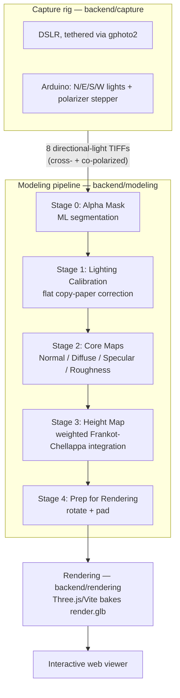

# 2D — Papyrus Pipeline

Photometric-stereo pipeline for flat manuscripts (papyrus, and any object that
needs fine surface detail but no real depth). A single Tkinter launcher ties the
sub-stages together. See the [repo setup guide](../SETUP.md) for first-time
install.

There are two builds of the launcher that share the same modeling and rendering
code and differ only in how they drive the capture rig:

- **`run.py`** — Windows build (gphoto2 through msys2, serial port `COM3`).
- **`run_linux.py`** — Linux build (native gphoto2/dcraw on PATH, serial port
  `/dev/ttyACM0`). See [Linux](#linux) below.

## How it works



**How it runs day to day:**
- `run.py` / `run_linux.py` is a single launcher whose buttons run top to
  bottom: select a working image set → (optional) Open Focus Viewer → Capture
  Calibration (once per rig setup) → Capture Scroll → Run Modeling Pipeline →
  Build 3D Model → Open Viewer.
- The **active working folder** holds one scan set; the pipeline reads and
  writes only inside it (`maps/` from modeling, `model/render.glb` from
  rendering), so each scan set is self-contained and a fresh capture just
  starts its own timestamped folder under `data/`.
- Ticking **"Scan both sides of the object"** shoots two scan sets (pausing
  for you to flip the object) into `side1/`/`side2/` subfolders, and modeling
  + rendering then run once per side. Leaving it unticked keeps the older
  single-scan-set behavior.
- The individual numbered steps always force a re-run; **"Run Everything"**
  and selecting a working image set instead skip any stage whose output
  already exists in that folder — handy for resuming after Stage 2 or 3 fails
  without redoing an earlier stage.
- Stage 0 (background removal) auto-detects the GPU: the run log prints
  `Device : CUDA` when `onnxruntime` reports a `CUDAExecutionProvider`, or
  `Device : CPU` otherwise — no config needed either way, only the installed
  wheels differ (see [GPU acceleration](#gpu-acceleration-optional--cuda--nvcc)
  below).

## Prerequisites

### Windows

- **OS: Windows** (the capture rig and launcher assume Windows paths/tools).
- **Python 3.9–3.12** with tkinter (install Python with the Tcl/Tk option, and
  tick "Add python.exe to PATH" in the installer). Get it from
  https://www.python.org/downloads/. Do **not** use 3.13/3.14 — the pinned
  `numpy<2.0` (and scipy/opencv/rembg) have no prebuilt wheels there and pip will
  try to compile numpy and fail.
- **Node.js LTS** on PATH — needed for the "Build 3D Model" (rendering) step.
  Get it from https://nodejs.org/ (tick "Add to PATH").
- **Capture-rig tools** (only if you run the hardware capture / focus viewer):
  - **msys2** with gphoto2 — https://www.msys2.org/ , then in the MSYS2 MINGW64
    shell: `pacman -S mingw-w64-x86_64-gphoto2`. Add the MSYS2 `mingw64\bin`
    folder to your PATH so `gphoto2` is callable from the launcher.
  - **dcraw** on PATH (converts `.cr2` → `.tiff`). Windows binary:
    https://sourceforge.net/app/dcraw/ (download `DCRaw_V9.28.exe` and put it on
    your PATH).
  - **Zadig** — camera USB driver swap, **required on Windows for gphoto2 to see
    the DSLR**. See [Camera driver setup (Zadig)](#camera-driver-setup-zadig-windows-only)
    below.

> **Putting tools on PATH:** several tools above must be on your PATH so the
> launcher (and MSYS2) can find them. If you're not sure how, follow this guide:
> https://www.howtogeek.com/787217/how-to-edit-environment-variables-on-windows-10-or-11/

#### Camera driver setup (Zadig, Windows only)

On Windows, `gphoto2`/libusb can't talk to the DSLR until the camera's USB
driver is replaced with **WinUSB** using [Zadig](https://zadig.akeo.ie/)
(download the standalone `.exe` — no install needed):

1. Connect the camera over USB and switch it **on** (put it in PC/PTP mode if it
   has one). Close any Canon/vendor software (e.g. EOS Utility) that may grab it.
2. Run Zadig, then **Options → List All Devices**.
3. In the dropdown, select your camera (e.g. "Canon Digital Camera").
4. Set the target driver to **WinUSB** and click **Replace Driver**
   (or **Install Driver**).
5. Confirm with `gphoto2 --auto-detect` in the MSYS2 MINGW64 shell — the camera
   should now be listed.

> To go back to using the camera with its normal vendor software, uninstall the
> WinUSB driver from Windows Device Manager (or reinstall the vendor driver).

### Linux

- **Python 3.9–3.12** with tkinter — on Debian/Ubuntu:
  `sudo apt install python3-tk`. Do **not** use 3.13/3.14 (no prebuilt wheels
  for the pinned `numpy<2.0` and friends).
- **Node.js LTS** on PATH — needed for the "Build 3D Model" (rendering) step.
- **Capture-rig tools** (only if you run the hardware capture / focus viewer):
  - **gphoto2** and **dcraw** on PATH — `sudo apt install gphoto2 dcraw`
    (they are called directly, no msys2 needed).
  - Serial access to the Arduino: the scripts default to `/dev/ttyACM0`
    (override with the `PAPYRUS_SERIAL_PORT` env var). Add yourself to the
    `dialout` group for permission: `sudo usermod -a -G dialout $USER`, then
    log out and back in.

## Setup

`run.py` self-installs most dependencies. Launch it and click
**Install Python Dependencies**, which runs `pip install -r
backend/modeling/requirements.txt pyserial` and `npm install` in the renderer
for you:

```bash
python run.py
```

The only things it can't install are Node.js, gphoto2 (msys2 on Windows), and
dcraw — see Prerequisites above. To install the Python deps manually instead, see
[`backend/modeling/README.md`](backend/modeling/README.md).

### GPU acceleration (optional — CUDA / `nvcc`)

Stage 0 of the modeling pipeline (background removal via `rembg`) runs on the CPU
by default. It transparently uses an NVIDIA GPU when one is available, which makes
mask generation several times faster — but that path needs the **CUDA toolkit**
(which provides `nvcc`) installed alongside a driver and cuDNN. This is entirely
optional; skip it to stay on CPU.

1. **NVIDIA driver + GPU.** Confirm the card is visible:

   ```bash
   nvidia-smi
   ```

2. **Install the CUDA toolkit (`nvcc`).** onnxruntime-gpu/torch need the matching
   CUDA runtime that the toolkit installs:

   - **Windows** — download the **CUDA Toolkit** installer from
     https://developer.nvidia.com/cuda-downloads (it installs `nvcc.exe` and adds
     it to PATH).
   - **Linux** — `sudo apt install nvidia-cuda-toolkit`, or NVIDIA's versioned
     `cuda-toolkit-12-x` package from the CUDA repo for a specific CUDA version.

   Verify the compiler is on PATH:

   ```bash
   nvcc --version
   ```

3. **Install cuDNN** for your CUDA version (required by `onnxruntime-gpu`):
   https://developer.nvidia.com/cudnn.

4. **Install the GPU Python wheels** in place of the CPU defaults — the GPU build
   of onnxruntime plus a CUDA build of torch (still honouring the `numpy<2.0`
   pin):

   ```bash
   pip install rembg[gpu] onnxruntime-gpu
   pip install torch --index-url https://download.pytorch.org/whl/cu121
   ```

   (Swap `cu121` for the CUDA version you installed above.)

The pipeline auto-detects the GPU: when `onnxruntime` reports a
`CUDAExecutionProvider` it prints `Device : CUDA`, otherwise it falls back to
`Device : CPU`. See
[`backend/modeling/README.md`](backend/modeling/README.md#gpu-acceleration).

## Usage

Run `python run.py` (Windows) or `python3 run_linux.py` (Linux) and click the
buttons top to bottom (select working image set → capture → run modeling → build
model → open viewer). The active working folder holds one scan set and receives
all pipeline output, so each set is self-contained. Full flow is documented in
the module docstring at the top of the launcher.

### Linux

The Linux build is `run_linux.py`. It is the same launcher as `run.py` and runs
the identical modeling and rendering stages; the only difference is the capture
scripts it invokes (`backend/capture/arduinoIntegration_linux.py` and
`focusViewer_linux.py`), which call gphoto2/dcraw natively and default to the
`/dev/ttyACM0` serial port:

```bash
python3 run_linux.py
```

## Structure

```
run.py                                Windows launcher + dependency installer
run_linux.py                          Linux launcher (native gphoto2/dcraw)
backend/capture/                      DSLR + Arduino capture rig — see backend/capture/README.md
  arduinoIntegration.py               Windows capture loop (gphoto2 via msys2)
  arduinoIntegration_linux.py         Linux capture loop (native gphoto2)
  focusViewer.py / focusViewer_linux.py   Windows / Linux focus viewers
backend/modeling/                     Photometric-stereo pipeline — see backend/modeling/README.md
backend/rendering/                    Three.js / Vite GLB baker  — see backend/rendering/README.md
```
