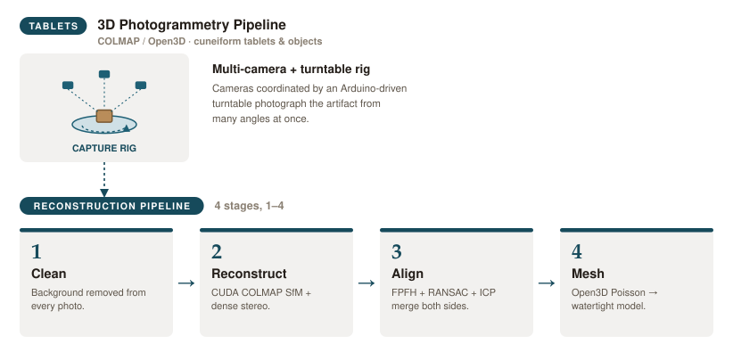

# 3D — Tablet Photogrammetry Pipeline

COLMAP-based photogrammetry for cuneiform tablets (and any 3D object placed on
the rig): multi-camera capture → COLMAP reconstruction → meshed model. See the
[repo setup guide](../SETUP.md) for first-time install.

## How it works



**How it runs day to day:**
- `modelingPipeline/app.py` is a single Tkinter GUI that runs the four stages
  above in order against one working folder in `data/`, one photo set per side.
- **Stage 1** removes each photo's background (`rembg`, GPU-accelerated when
  available) and writes masked PNGs to `processed/`. By default it also
  hard-thresholds rembg's soft alpha matte to a clean binary mask (`--hard-mask`,
  on by default) — COLMAP only ever sees RGB, not alpha, so a soft edge leaves
  real background colour blended into the tablet's boundary pixels, which can
  reconstruct as speckled noise along the mesh edges. A ragged mask edge throws
  off alignment later, so `erode_masks.py <folder> <px>` (or `process_photos.py
  --erode-px N` inline) shrinks the alpha mask inward to clean it up.
- **Stage 2** hands the masked photos to COLMAP for GPU structure-from-motion +
  dense stereo, run once per side. `run.sh` resolves the COLMAP binary in this
  order: the `FIPMESH_COLMAP_BIN` env var → `./colmap_local` → `colmap` on
  PATH — so if no CUDA build is in place it silently falls back to a CPU-only
  `apt` COLMAP, which still works but is far slower. `FIPMESH_SKIP_RECON=1`
  reruns later stages without repeating an already-finished reconstruction.
- **Stage 3** aligns the two sides' point clouds with FPFH feature matching +
  RANSAC, refined with ICP, into one merged cloud.
- **Stage 4** runs Open3D Poisson reconstruction on the merged cloud to produce
  the final textured `model.gltf`.
- `src/check_config.sh` runs at startup and reports missing system/Python
  dependencies (with an `apt-get install` suggestion on Debian/Ubuntu), so a
  broken environment fails fast instead of partway through a multi-hour run.
- Dense reconstruction and rembg are memory-hungry; WSL2 caps its VM at half
  the host RAM by default, so long runs can get `Killed` — see
  [Giving WSL more RAM](../SETUP.md#giving-wsl-more-ram--a-bigger-swap-pagefile).

## Prerequisites

- **OS: WSL2 (Ubuntu 24.04 LTS)** — the reconstruction runs under WSL with WSLg
  for the GUI. Use **24.04**, not the latest Ubuntu — newer releases ship a GCC
  too new for CUDA and COLMAP won't build. See [`../SETUP.md`](../SETUP.md) for the
  WSL2 install steps.
- **NVIDIA GPU + Windows-host driver**, with `nvidia-smi` working inside WSL.
- **CUDA-enabled COLMAP** — the stock `apt` package is CPU-only; the pipeline
  prefers a local CUDA build. See
  [`modelingPipeline/BUILDING_COLMAP.md`](modelingPipeline/BUILDING_COLMAP.md).
- **exiftool** (`sudo apt install exiftool`) — COLMAP is fed metadata-stripped
  images.
- **python3-tk** (`sudo apt install python3-tk`) — the capture and reconstruction
  GUIs use tkinter, which Ubuntu's stock `python3` does not bundle.
- **Capture only** (running `captureApp/capture_app_parallel.py` against the
  physical rig): `gphoto2` on PATH, plus the `pyserial` and `pillow` Python
  packages. See [Capture setup](#capture-setup) below — not needed if you only
  run reconstruction on already-captured images.
- **cuDNN 9 for CUDA 12** (`cudnn9-cuda-12`) — `rembg[gpu]` pulls
  `onnxruntime-gpu`, which needs the cuDNN runtime alongside CUDA. Without it
  background removal fails at model load (`libcudnn.so.9: cannot open shared
  object file`). It is **not** in Ubuntu's default repos — you must add NVIDIA's
  CUDA repo + GPG key first (see [Setup](#setup) below). On a CPU-only machine,
  use `rembg` (no `[gpu]`) instead and skip this.
- Python 3.9–3.12 and the deps in `modelingPipeline/requirements.txt` (open3d
  has no prebuilt wheels for 3.13/3.14 yet). Pinned there: `numpy<2.5`,
  `onnxruntime-gpu<1.27`, and `torch` (required by rembg's birefnet model).

## Setup

> **First time on a fresh WSL/Ubuntu box?** Do the system-level steps in
> [`../SETUP.md`](../SETUP.md#wsl2-for-3d) first — installing Ubuntu 24.04, the
> Windows-host NVIDIA driver, `apt update && upgrade` + build tools, and the
> cuDNN 9 / CUDA repo. This section is the quick command summary plus the two
> steps that live here: the Python deps and the COLMAP build.

Refresh the package index and install the base tools (build toolchain,
`exiftool`, and `python3-tk`):

```bash
sudo apt update && sudo apt upgrade -y
sudo apt install -y build-essential git wget curl python3-pip python3-venv
sudo apt install -y exiftool python3-tk
```

Add NVIDIA's CUDA repo + GPG key and install **cuDNN 9 for CUDA 12** (needed by
`rembg[gpu]`; skip on a CPU-only machine — see the
[cuDNN step in `../SETUP.md`](../SETUP.md#wsl2-for-3d) for the full explanation):

```bash
wget https://developer.download.nvidia.com/compute/cuda/repos/wsl-ubuntu/x86_64/cuda-keyring_1.1-1_all.deb
sudo dpkg -i cuda-keyring_1.1-1_all.deb
sudo apt-get update && sudo apt-get -y install cudnn9-cuda-12
ldconfig -p | grep libcudnn   # verify the runtime is present
```

Then install the Python deps (use `python3`, not `python`):

```bash
python3 -m pip install --break-system-packages -r modelingPipeline/requirements.txt
```

Then build CUDA COLMAP (one-time) — see
[`modelingPipeline/BUILDING_COLMAP.md`](modelingPipeline/BUILDING_COLMAP.md).

> **Out of memory / `Killed` mid-run?** COLMAP dense reconstruction and rembg are
> memory-hungry. WSL2 caps its VM at half the host RAM by default — raise the RAM
> and swap (pagefile) limits via `.wslconfig`; see
> [`../SETUP.md`](../SETUP.md#giving-wsl-more-ram--a-bigger-swap-pagefile).

## Capture setup

Only needed to run the capture app (`captureApp/capture_app_parallel.py`)
against the physical multi-camera rig. If you are only reconstructing images
someone else captured, skip this section.

The capture apps drive the Canon DSLRs through **gphoto2** and talk to the rig's
Arduino over a **serial port**, so on the capture workstation you need:

- **gphoto2** on PATH — the apps shell out to it to detect and trigger the
  cameras:

  ```bash
  sudo apt install gphoto2
  ```

- **python3-tk** — the capture GUI is tkinter (same package as the reconstruction
  GUI above; `sudo apt install python3-tk`).

- **pyserial** and **pillow** Python packages — `pyserial` for the Arduino serial
  link, `pillow` for the in-app camera preview thumbnails:

  ```bash
  python3 -m pip install --break-system-packages pyserial pillow
  ```

- **Serial access** — add yourself to the `dialout` group so you can open the
  Arduino's serial device without `sudo`, then log out and back in:

  ```bash
  sudo usermod -a -G dialout $USER
  ```

> **Running capture under WSL2:** WSL does not see USB devices by default, so the
> DSLRs and the Arduino are invisible to gphoto2/pyserial until you attach them
> with [`usbipd-win`](https://learn.microsoft.com/windows/wsl/connect-usb) from an
> elevated Windows PowerShell (`usbipd list`, then `usbipd attach --wsl --busid
> <BUSID>` for each camera and the Arduino). If that is fiddly on your rig, run
> the capture apps on native Linux (or Windows) instead — only the reconstruction
> stage requires WSL/CUDA.

## Usage

- **Capture** (needs the physical rig): `python3 captureApp/capture_app_parallel.py`;
  rig firmware in `arduinoCode/`.
- **Reconstruction**: `python3 modelingPipeline/app.py` — see
  [`modelingPipeline/README.md`](modelingPipeline/README.md) for the four-stage
  pipeline.

## Structure

```
captureApp/capture_app_parallel.py   Multi-camera capture GUI
arduinoCode/                         Rig firmware (arduinoCode.ino)
modelingPipeline/                    Reconstruction pipeline — see modelingPipeline/README.md
```
