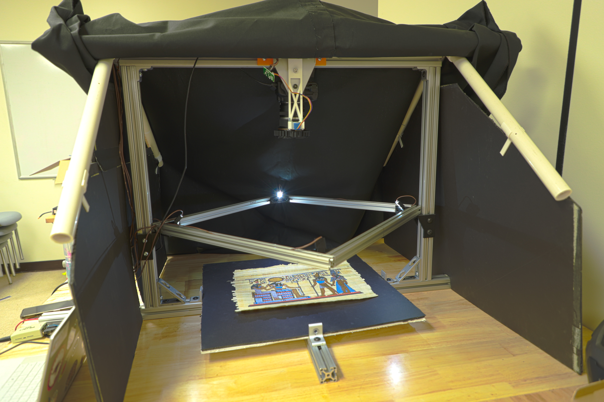
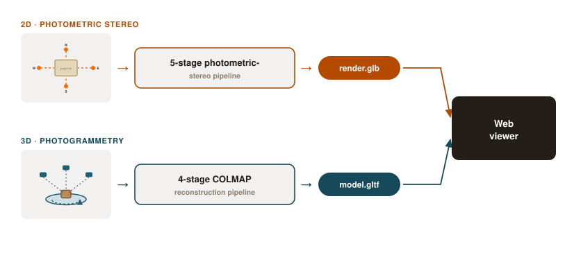

# Digital-Twins-of-Artifacts
Digital Twins of Artifacts is a comprehensive system for creating 2D and 3D models/replicas of historical artifacts in order to help preserve them, as well as make them more accessible to the world, developed by RIT students in collaboration with the RIT Chester F. Carlson Center for Imaging Science and the RIT Cary Graphic Arts Collection, and sponsored in part by the Charles and Karin Hoffman Endowed Fund. 

This system was built from work started during the 2025-26 Freshman Imaging Project class ("FIP"), a two-semester class where Imaging Science and Motion Picture Science freshmen are given an open-ended problem to solve, and spend the class researching and developing a solution. The group worked diligently to lay the foundation for the system. The summer after, Carter & Iris stayed to continue improving and integrating the systems during the 2026 Extended Freshman Imaging Project ("E-FIP"), a 10-week summer program funded by the Charles and Karin Hoffman Endowed Fund.




3D/ is primarily for scanning Cuneiform Tablets, but can be used for any 3D object placed on it.
2D/ is primarily for Papyrus Manuscripts, but can be used for any object that doesn't need thickness or height in the output, just detail

## System overview

Which rig an artifact uses depends on whether its shape carries meaning in
three dimensions. Both run capture → an automated modeling pipeline → the
shared web viewer, but the rig hardware and pipeline stages differ:



For the hardware + pipeline breakdown of each system, including how each one
behaves at runtime, see [`2D/README.md`](2D/README.md#how-it-works) and
[`3D/README.md`](3D/README.md#how-it-works).

## Repository layout

```
2D/        Papyrus photometric-stereo pipeline (Windows/Linux) — see 2D/README.md
3D/        Cuneiform-tablet COLMAP photogrammetry (WSL2)       — see 3D/README.md
website/   Static artifact gallery site (any OS)               — see website/README.md
```

## Setup

New here? Start with [`SETUP.md`](SETUP.md) for the prerequisites matrix and
per-OS install steps, then follow the README inside the pillar you need.

This system is still actively being worked on/developed, and features are prone to change. Not all features may work as intended. 
For questions and comments, feel free to reach out to Carter at cjl6825@rit.edu